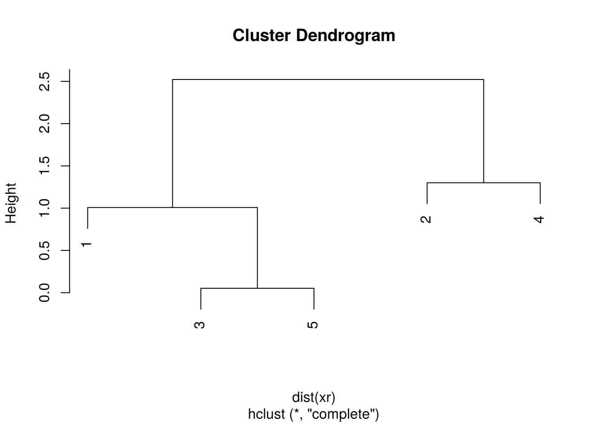

# Unsupervised Learning 


## Introduction

In **unsupervised learning** (UML), no labels are provided, and the
learning algorithm focuses solely on detecting structure in unlabelled
input data. One generally differentiates between

- **Clustering**, where the goal is to find homogeneous subgroups
  within the data; the grouping is based on distance between
  observations.
  
- **Dimensionality reduction**, where the goal is to identify patterns in
  the features of the data. Dimensionality reduction is often used to
  facilitate visualisation of the data, as well as a pre-processing
  method before supervised learning.

UML presents specific challenges and benefits:

- there is no single goal in UML
- there is generally much more unlabelled data available than labelled
  data.

## k-means clustering

The k-means clustering algorithms aims at partitioning *n*
observations into a fixed number of *k* clusters. The algorithm will
find homogeneous clusters. 

In R, we use


```r
library(BiocStyle)
stats::kmeans(x, centers = 3, nstart = 10)
```

where 

- `x` is a numeric data matrix
- `centers` is the pre-defined number of clusters
- the k-means algorithm has a random component and can be repeated
  `nstart` times to improve the returned model

> Challenge:
>
> - To learn about k-means, let's use the `iris` dataset with the sepal and
>   petal length variables only (to facilitate visualisation). Create
>   such a data matrix and name it `x`


> - Run the k-means algorithm on the newly generated data `x`, save
>   the results in a new variable `cl`, and explore its output when
>   printed.


> - The actual results of the algorithms, i.e. the cluster membership
>   can be accessed in the `clusters` element of the clustering result
>   output. Use it to colour the inferred clusters to generate a figure
>   like that shown below.

<div class="figure">

<p class="caption">(\#fig:solkmplot)k-means algorithm on sepal and petal lengths</p>
</div>

<details>

```r
i <- grep("Length", names(iris))
x <- iris[, i]
cl <- kmeans(x, 3, nstart = 10)
plot(x, col = cl$cluster)
```
</details>

### How does k-means work

**Initialisation**: randomly assign class membership


```r
set.seed(12)
init <- sample(3, nrow(x), replace = TRUE)
plot(x, col = init)
```

<div class="figure">

<p class="caption">(\#fig:kmworksinit)k-means random intialisation</p>
</div>

**Iteration**:

1. Calculate the centre of each subgroup as the average position of
   all observations is that subgroup.
2. Each observation is then assigned to the group of its nearest
   centre.
 
It's also possible to stop the algorithm after a certain number of
iterations, or once the centres move less than a certain distance.


```r
par(mfrow = c(1, 2))
plot(x, col = init)
centres <- sapply(1:3, function(i) colMeans(x[init == i, ], ))
centres <- t(centres)
points(centres[, 1], centres[, 2], pch = 19, col = 1:3)

tmp <- dist(rbind(centres, x))
tmp <- as.matrix(tmp)[, 1:3]

ki <- apply(tmp, 1, which.min)
ki <- ki[-(1:3)]

plot(x, col = ki)
points(centres[, 1], centres[, 2], pch = 19, col = 1:3)
```

<div class="figure">

<p class="caption">(\#fig:kmworksiter)k-means iteration: calculate centers (left) and assign new cluster membership (right)</p>
</div>

**Termination**: Repeat iteration until no point changes its cluster
membership.


### Model selection

Due to the random initialisation, one can obtain different clustering
results. When k-means is run multiple times, the best outcome,
i.e. the one that generates the smallest *total within cluster sum of
squares (SS)*, is selected. The total within SS is calculated as:

For each cluster results:

- for each observation, determine the squared euclidean distance from
  observation to centre of cluster
- sum all distances

Note that this is a **local minimum**; there is no guarantee to obtain
a global minimum.

> Challenge:
>
> Repeat k-means on our `x` data multiple times, setting the number of
> iterations to 1 or greater and check whether you repeatedly obtain
> the same results. Try the same with random data of identical
> dimensions.

<details>

```r
cl1 <- kmeans(x, centers = 3, nstart = 10)
cl2 <- kmeans(x, centers = 3, nstart = 10)
table(cl1$cluster, cl2$cluster)
```

```
##    
##      1  2  3
##   1  0 41  0
##   2 51  0  0
##   3  0  0 58
```

```r
cl1 <- kmeans(x, centers = 3, nstart = 1)
cl2 <- kmeans(x, centers = 3, nstart = 1)
table(cl1$cluster, cl2$cluster)
```

```
##    
##      1  2  3
##   1 41  0  0
##   2  0  0 58
##   3  0 51  0
```

```r
set.seed(42)
xr <- matrix(rnorm(prod(dim(x))), ncol = ncol(x))
cl1 <- kmeans(xr, centers = 3, nstart = 1)
cl2 <- kmeans(xr, centers = 3, nstart = 1)
table(cl1$cluster, cl2$cluster)
```

```
##    
##      1  2  3
##   1  0 52  0
##   2  0  0 46
##   3 52  0  0
```

```r
diffres <- cl1$cluster != cl2$cluster
par(mfrow = c(1, 2))
plot(xr, col = cl1$cluster, pch = ifelse(diffres, 19, 1))
plot(xr, col = cl2$cluster, pch = ifelse(diffres, 19, 1))
```

<div class="figure">

<p class="caption">(\#fig:selrep)Different k-means results on the same (random) data</p>
</div>
</details>

### How to determine the number of clusters

1. Run k-means with `k=1`, `k=2`, ..., `k=n`
2. Record total within SS for each value of k.
3. Choose k at the *elbow* position, as illustrated below.


> Challenge
>
> Calculate the total within sum of squares for k from 1 to 5 for our
> `x` test data, and reproduce the figure above. 

<details>

```r
ks <- 1:5
tot_within_ss <- sapply(ks, function(k) {
    cl <- kmeans(x, k, nstart = 10)
    cl$tot.withinss
})
plot(ks, tot_within_ss, type = "b")
```


</details>

## Hierarchical clustering

### How does hierarchical clustering work

**Initialisation**:  Starts by assigning each of the n points its own cluster

**Iteration**

1. Find the two nearest clusters, and join them together, leading to
   n-1 clusters
2. Continue the cluster merging process until all are grouped into a
   single cluster

**Termination:** All observations are grouped within a single cluster.

<div class="figure">

<p class="caption">(\#fig:hcldata)Hierarchical clustering: initialisation (left) and colour-coded results after iteration (right).</p>
</div>

The results of hierarchical clustering are typically visualised along
a **dendrogram**, where the distance between the clusters is
proportional to the branch lengths.


<div class="figure">

<p class="caption">(\#fig:hcldendro)Visualisation of the hierarchical clustering results on a dendrogram</p>
</div>

In R:

- Calculate the distance using `dist`, typically the Euclidean
  distance.
- Hierarchical clustering on this distance matrix using `hclust`

> Challenge
> 
> Apply hierarchical clustering on the `iris` data and generate a
> dendrogram using the dedicated `plot` method.

<details>

```r
d <- dist(iris[, 1:4])
hcl <- hclust(d)
hcl
```

```
## 
## Call:
## hclust(d = d)
## 
## Cluster method   : complete 
## Distance         : euclidean 
## Number of objects: 150
```

```r
plot(hcl)
```


</details>

### Defining clusters

After producing the hierarchical clustering result, we need to *cut
the tree (dendrogram)* at a specific height to defined the
clusters. For example, on our test dataset above, we could decide to
cut it at a distance around 1.5, with would produce 2 clusters.

<div class="figure">

<p class="caption">(\#fig:cuthcl)Cutting the dendrogram at height 1.5.</p>
</div>

In R we can us the `cutree` function to

- cut the tree at a specific height: `cutree(hcl, h = 1.5)`
- cut the tree to get a certain number of clusters: `cutree(hcl, k = 2)`

> Challenge
> 
> - Cut the iris hierarchical clustering result at a height to obtain
>   3 clusters by setting `h`.
> - Cut the iris hierarchical clustering result at a height to obtain
>   3 clusters by setting directly `k`, and verify that both provide
>   the same results.


<details>

```r
plot(hcl)
abline(h = 3.9, col = "red")
```


```r
cutree(hcl, k = 3)
```

```
##   [1] 1 1 1 1 1 1 1 1 1 1 1 1 1 1 1 1 1 1 1 1 1 1 1 1 1 1 1 1 1 1 1 1 1 1 1
##  [36] 1 1 1 1 1 1 1 1 1 1 1 1 1 1 1 2 2 2 3 2 3 2 3 2 3 3 3 3 2 3 2 3 3 2 3
##  [71] 2 3 2 2 2 2 2 2 2 3 3 3 3 2 3 2 2 2 3 3 3 2 3 3 3 3 3 2 3 3 2 2 2 2 2
## [106] 2 3 2 2 2 2 2 2 2 2 2 2 2 2 2 2 2 2 2 2 2 2 2 2 2 2 2 2 2 2 2 2 2 2 2
## [141] 2 2 2 2 2 2 2 2 2 2
```

```r
cutree(hcl, h = 3.9)
```

```
##   [1] 1 1 1 1 1 1 1 1 1 1 1 1 1 1 1 1 1 1 1 1 1 1 1 1 1 1 1 1 1 1 1 1 1 1 1
##  [36] 1 1 1 1 1 1 1 1 1 1 1 1 1 1 1 2 2 2 3 2 3 2 3 2 3 3 3 3 2 3 2 3 3 2 3
##  [71] 2 3 2 2 2 2 2 2 2 3 3 3 3 2 3 2 2 2 3 3 3 2 3 3 3 3 3 2 3 3 2 2 2 2 2
## [106] 2 3 2 2 2 2 2 2 2 2 2 2 2 2 2 2 2 2 2 2 2 2 2 2 2 2 2 2 2 2 2 2 2 2 2
## [141] 2 2 2 2 2 2 2 2 2 2
```

```r
identical(cutree(hcl, k = 3), cutree(hcl, h = 3.9))
```

```
## [1] TRUE
```
</details>


> Challenge
> 
> Using the same value `k = 3`, verify if k-means and hierarchical
> clustering produce the same results on the `iris` data.
> 
> Which one, if any, is correct?


<details>

```r
km <- kmeans(iris[, 1:4], centers = 3, nstart = 10)
hcl <- hclust(dist(iris[, 1:4]))
table(km$cluster, cutree(hcl, k = 3))
```

```
##    
##      1  2  3
##   1  0 34 28
##   2  0 38  0
##   3 50  0  0
```

```r
par(mfrow = c(1, 2))
plot(iris$Petal.Length, iris$Sepal.Length, col = km$cluster, main = "k-means")
plot(iris$Petal.Length, iris$Sepal.Length, col = cutree(hcl, k = 3), main = "Hierarchical clustering")
```


```r
## Checking with the labels provided with the iris data
table(iris$Species, km$cluster)
```

```
##             
##               1  2  3
##   setosa      0  0 50
##   versicolor 48  2  0
##   virginica  14 36  0
```

```r
table(iris$Species, cutree(hcl, k = 3))
```

```
##             
##               1  2  3
##   setosa     50  0  0
##   versicolor  0 23 27
##   virginica   0 49  1
```
</details>

## Pre-processing

Many of the machine learning methods that are regularly used are
sensitive to difference scales. This applies to unsupervised methods
as well as supervised methods, as we will see in the next chapter.

A typical way to pre-process the data prior to learning is to scale
the data, or apply principal component analysis (next section). Scaling
assures that all data columns have a mean of 0 and standard deviation of 1.

In R, scaling is done with the `scale` function.

> Challenge
>
> Using the `mtcars` data as an example, verify that the variables are
> of different scales, then scale the data. To observe the effect
> different scales, compare the hierarchical clusters obtained on the
> original and scaled data.

<details>

```r
colMeans(mtcars)
```

```
##        mpg        cyl       disp         hp       drat         wt 
##  20.090625   6.187500 230.721875 146.687500   3.596563   3.217250 
##       qsec         vs         am       gear       carb 
##  17.848750   0.437500   0.406250   3.687500   2.812500
```

```r
hcl1 <- hclust(dist(mtcars))
hcl2 <- hclust(dist(scale(mtcars)))
par(mfrow = c(1, 2))
plot(hcl1, main = "original data")
plot(hcl2, main = "scaled data")
```


</details>

## Principal component analysis (PCA)

**Dimensionality reduction** techniques are widely used and versatile
techniques that can be used to:

- find structure in features
- pre-processing for other ML algorithms, and
- aid in visualisation.

The basic principle of dimensionality reduction techniques is to
transform the data into a new space that summarise properties of the
whole data set along a reduced number of dimensions. These are then
ideal candidates used to visualise the data along these reduced number
of informative dimensions.

### How does it work

Principal Component Analysis (PCA) is a technique that transforms the
original n-dimensional data into a new n-dimensional space. 

- These new dimensions are linear combinations of the original data,
  i.e.  they are composed of proportions of the original variables.
- Along these new dimensions, called principal components, the data
  expresses most of its variability along the first PC, then second,
  ... 
- Principal components are orthogonal to each other,
  i.e. non-correlated.


<div class="figure">

<p class="caption">(\#fig:pcaex)Original data (left). PC1 will maximise the variability while minimising the residuals (centre). PC2 is orthogonal to PC1 (right).</p>
</div>

In R, we can use the `prcomp` function. 

Let's explore PCA on the `iris` data. While it contains only 4
variables, is already becomes difficult to visualise the 3 groups
along all these dimensions.


```r
pairs(iris[, -5], col = iris[, 5], pch = 19)
```


Let's use PCA to reduce the dimension. 


```r
irispca <- prcomp(iris[, -5])
summary(irispca)
```

```
## Importance of components:
##                           PC1     PC2    PC3     PC4
## Standard deviation     2.0563 0.49262 0.2797 0.15439
## Proportion of Variance 0.9246 0.05307 0.0171 0.00521
## Cumulative Proportion  0.9246 0.97769 0.9948 1.00000
```

A summary of the `prcomp` output shows that along PC1 along, we are
able to retain over 92% of the total variability in the data.

<div class="figure">

<p class="caption">(\#fig:histpc1)Iris data along PC1.</p>
</div>

### Visualisation

A **biplot** features all original points re-mapped (rotated) along the
first two PCs as well as the original features as vectors along the
same PCs. Feature vectors that are in the same direction in PC space
are also correlated in the original data space.


```r
biplot(irispca)
```


One important piece of information when using PCA is the proportion of
variance explained along the PCs, in particular when dealing with high
dimensional data, as PC1 and PC2 (that are generally used for
visualisation), might only account for an insufficient proportion of
variance to be relevant on their own. 

In the code chunk below, I extract the standard deviations from the
PCA result to calculate the variances, then obtain the percentage of
and cumulative variance along the PCs.
  

```r
var <- irispca$sdev^2
(pve <- var/sum(var))
```

```
## [1] 0.924618723 0.053066483 0.017102610 0.005212184
```

```r
cumsum(pve)
```

```
## [1] 0.9246187 0.9776852 0.9947878 1.0000000
```

> Challenge
> 
> - Repeat the PCA analysis on the iris dataset above, reproducing the
>   biplot and preparing a barplot of the percentage of variance
>   explained by each PC.
> - It is often useful to produce custom figures using the data
>   coordinates in PCA space, which can be accessed as `x` in the
>   `prcomp` object. Reproduce the PCA plots below, along PC1 and PC2
>   and PC3 and PC4 respectively.


<details>

```r
par(mfrow = c(1, 2))
plot(irispca$x[, 1:2], col = iris$Species)
plot(irispca$x[, 3:4], col = iris$Species)
```
</details>

### Data pre-processing 


```r
library(BiocStyle)
```


We haven't looked at other `prcomp` parameters, other that the first
one, `x`. There are two other ones that are or importance, in
particular in the light of the section on pre-processing above, which
are `center` and `scale.`. The former is set to `TRUE` by default,
while the second one is set the `FALSE`.

> Challenge
> 
> Repeat the analysis comparing the need for scaling on the `mtcars`
> dataset, but using PCA instead of hierarchical clustering. When
> comparing the two.

<details>

```r
par(mfrow = c(1, 2))
biplot(prcomp(mtcars, scale = FALSE), main = "No scaling")  ## 1
biplot(prcomp(mtcars, scale = TRUE), main = "With scaling") ## 2
```


Without scaling, `disp` and `hp` are the features with the highest
loadings along PC1 and 2 (all others are negligible), which are also
those with the highest units of measurement. Scaling removes this
effect.  </details>

### Final comments on PCA

Real datasets often come with **missing values**. In R, these should
be encoded using `NA`. Unfortunately, PCA cannot deal with missing
values, and observations containing `NA` values will be dropped
automatically. This is a viable solution only when the proportion of
missing values is low.

It is also possible to impute missing values. This is described in
greater details in the *Data pre-processing* section in the supervised
machine learning chapter. 

Finally, we should be careful when using categorical data in any of
the unsupervised methods described above. Categories are generally
represented as factors, which are encoded as integer levels, and might
give the impression that a distance between levels is a relevant
measure (which it is not, unless the factors are ordered). In such
situations, categorical data can be dropped, or it is possible to
encode categories as binary **dummy variables**. For example, if we
have 3 categories, say `A`, `B` and `C`, we would create two dummy
variables to encode the categories as:


       x    y
---  ---  ---
A      1    0
B      0    1
C      0    0

so that the distance between each category are approximately equal to
1. 

## t-Distributed Stochastic Neighbour Embedding

[t-Distributed Stochastic Neighbour Embedding](https://lvdmaaten.github.io/tsne/) (t-SNE)
is a *non-linear* dimensionality reduction technique, i.e. that
different regions of the data space will be subjected to different
transformations. t-SNE will compress small distances, thus bringing
close neighbours together, and will ignore large distances. It is
particularly well suited
for
[very high dimensional data](https://distill.pub/2016/misread-tsne/).

In R, we can use the `Rtsne` function from the *[Rtsne](https://CRAN.R-project.org/package=Rtsne)*. 
Before, we however need to remove any duplicated entries in the
dataset.


```r
library("Rtsne")
uiris <- unique(iris[, 1:5])
iristsne <- Rtsne(uiris[, 1:4])
plot(iristsne$Y, col = uiris$Species)
```


As with PCA, the data can be scaled and centred prior the running
t-SNE (see the `pca_center` and `pca_scale` arguments). The algorithm
is stochastic, and will produce different results at each repetition.

### Parameter tuning

t-SNE (as well as many other methods, in particular classification
algorithms) has two important parameters that can substantially
influence the clustering of the data

- **Perplexity**: balances global and local aspects of the data.
- **Iterations**: number of iterations before the clustering is
  stopped.

It is important to adapt these for different data. The figure below
shows a 5032 by 20 dataset that represent protein sub-cellular
localisation.


As a comparison, below are the same data with PCA (left) and t-SNE
(right).


