# Supervised Learning

## Introduction


```r
library(BiocStyle)
```

In **supervised learning** (SML), the learning algorithm is presented
with labelled example inputs, where the labels indicate the desired
output. SML itself is composed of **classification**, where the output
is qualitative, and **regression**, where the output is quantitative.

When two sets of labels, or classes, are available, one speaks of
**binary classification**. A classical example thereof is labelling an
email as *spam* or *not spam*. When more classes are to be learnt, one
speaks of a **multi-class problem**, such as annotation of a new *Iris*
example as being from the *setosa*, *versicolor* or *virginica*
species. In these cases, the output is a single label (of one of the
anticipated classes). If multiple labels may be assigned to each
example, one speaks of **multi-label classification**.

## Preview

To start this chapter, let's use a simple, but useful classification
algorithm, k-nearest neighbours (kNN) to classify the *iris*
flowers. We will use the `knn` function from the *[class](https://CRAN.R-project.org/package=class)*
package.

K-nearest neighbours works by directly measuring the (Euclidean)
distance between observations and inferring the class of unlabelled data
from the class of its nearest neighbours. In the figure below, the
unlabelled instances *1* and *2* will be assigned classes *c1* (blue)
and *c2* (red) as their closest neighbours are red and blue,
respectively.


<div class="figure">
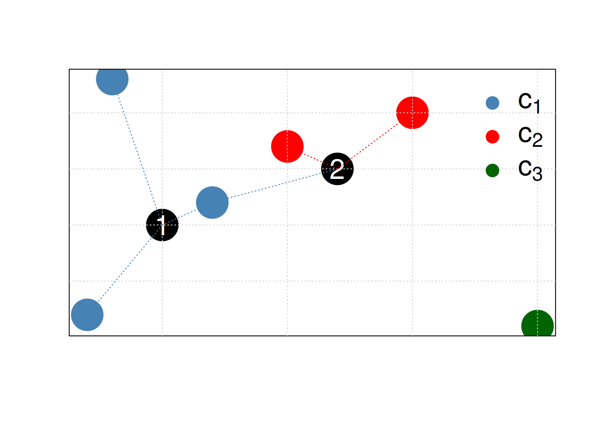
<p class="caption">(\#fig:knnex)Schematic illustrating the k nearest neighbors algorithm.</p>
</div>

Typically in machine learning, there are two clear steps, where one
first **trains** a model and then uses the model to **predict** new
outputs (class labels in this case). In the kNN, these two steps are
combined into a single function call to `knn`.

Lets draw a set of 50 random iris observations to train the model and
predict the species of another set of 50 randomly chosen flowers. The
`knn` function takes the training data, the new data (to be inferred)
and the labels of the training data, and returns (by default) the
predicted class.


```r
set.seed(12L)
tr <- sample(150, 50)
nw <- sample(150, 50)
library("class")
knnres <- knn(iris[tr, -5], iris[nw, -5], iris$Species[tr])
head(knnres)
```

```
## [1] versicolor setosa     versicolor setosa     setosa     setosa    
## Levels: setosa versicolor virginica
```

We can now compare the observed kNN-predicted class and the expected
known outcome and calculate the overall accuracy of our model.


```r
table(knnres, iris$Species[nw])
```

```
##             
## knnres       setosa versicolor virginica
##   setosa         20          0         0
##   versicolor      0         17         2
##   virginica       0          0        11
```

```r
mean(knnres == iris$Species[nw])
```

```
## [1] 0.96
```

We have omitted an important argument from `knn`, which is the
parameter *k* of the classifier. This parameter defines how many
nearest neighbours will be considered to assign a class to a new
unlabelled observation. From the arguments of the function,


```r
args(knn)
```

```
## function (train, test, cl, k = 1, l = 0, prob = FALSE, use.all = TRUE) 
## NULL
```

we see that the default value is 1. But is this a good value? Wouldn't
we prefer to look at more neighbours and infer the new class using a
vote based on more labels?

> Challenge
>
> Repeat the kNN classification above by using another value of k, and
> compare the accuracy of this new model to the one above. Make sure
> to use the same `tr` and `nw` training and new data to avoid any
> biases in the comparison.

<details>

```r
knnres5 <- knn(iris[tr, -5], iris[nw, -5], iris$Species[tr], k = 5)
mean(knnres5 == iris$Species[nw])
```

```
## [1] 0.94
```

```r
table(knnres5, knnres)
```

```
##             knnres
## knnres5      setosa versicolor virginica
##   setosa         20          0         0
##   versicolor      0         19         1
##   virginica       0          0        10
```
</details>

> Challenge
>
> Rerun the kNN classifier with a value of *k* > 1, and specify `prob
> = TRUE` to obtain the proportion of the votes for the winning class.

<details>

```r
knnres5prob <- knn(iris[tr, -5], iris[nw, -5], iris$Species[tr], k = 5, prob = TRUE)
table(attr(knnres5prob, "prob"))
```

```
## 
##               0.6               0.8 0.833333333333333                 1 
##                 3                13                 1                33
```
</details>


This introductory example leads to two important and related questions
that we need to consider:

- How can we do a good job in training and testing data? In the
  example above, we choose random training and new data.

- How can we estimate our model parameters (*k* in the example above)
  so as to obtain good classification accuracy?

## Model performance

### In-sample and out-of-sample error

In supervised machine learning, we have a desired output and thus know
precisely what is to be computed. It thus becomes possible to directly
evaluate a model using a quantifiable and objective metric. For
regression, we will use the **root mean squared error** (RMSE), which
is what linear regression (`lm` in R) seeks to minimise. For
classification, we will use **model prediction accuracy**.

Typically, we won't want to calculate any of these metrics using
observations that were also used to calculate the model. This
approach, called **in-sample error** leads to optimistic assessment of
our model. Indeed, the model has already *seen* these data upon
construction, and is considered optimised for these observations
in particular; it is said to **over-fit** the data. We prefer to
calculate an **out-of-sample error**, on new data, to gain a better
idea of how to model performs on unseen data, and estimate how well
the model **generalises**.

In this course, we will focus on the *[caret](https://CRAN.R-project.org/package=caret)* package for
Classification And REgression Training (see also
https://topepo.github.io/caret/index.html). It provides a common and
consistent interface to many, often repetitive, tasks in supervised
learning.


```r
library("caret")
```

```
## Loading required package: lattice
```

```
## Loading required package: ggplot2
```

```
## Registered S3 methods overwritten by 'ggplot2':
##   method         from 
##   [.quosures     rlang
##   c.quosures     rlang
##   print.quosures rlang
```

The code chunk below uses the `lm` function to model the price of
round cut diamonds and then predicts the price of these very same
diamonds with the `predict` function.


```r
data(diamonds)
model <- lm(price ~ ., diamonds)
p <- predict(model, diamonds)
```

> Challenge
>
> Calculate the root mean squared error for the prediction above

<details>

```r
## Error on prediction
error <- p - diamonds$price
rmse_in <- sqrt(mean(error^2)) ## in-sample RMSE
rmse_in
```

```
## [1] 1129.843
```
</details>

Let's now repeat the exercise above, but by calculating the
out-of-sample RMSE. We prepare a 80/20 split of the data and use
80% to fit our model, and predict the target variable (this is called the
**training data**), the price, on the 20% of unseen data (the **testing
data**).

> Challenge
>
> 1. Let's create a **random** 80/20 split to define the test and
>    train subsets.
> 2. Train a regression model on the training data.
> 3. Test the model on the testing data.
> 4. Calculating the out-of-sample RMSE.

<details>

```r
set.seed(42)
ntest <- nrow(diamonds) * 0.80
test <- sample(nrow(diamonds), ntest)
model <- lm(price ~ ., data = diamonds[test, ])
p <- predict(model, diamonds[-test, ])
error <- p - diamonds$price[-test]
rmse_out <- sqrt(mean(error^2)) ## out-of-sample RMSE
rmse_out
```

```
## [1] 1137.466
```
</details>

The values for the out-of-sample RMSE will vary depending on what
exact split was used. The diamonds is a rather extensive data set, and
thus even when building our model using a subset of the available data
(80% above), we manage to generate a model with a low RMSE, and
possibly lower than the in-sample error.

When dealing with datasets of smaller sizes, however, the presence of
a single outlier in the train and test data split can substantially
influence the model and the RMSE. We can't rely on such an approach and
need a more robust one where we can generate and use multiple,
different train/test sets to sample a set of RMSEs, leading to a
better estimate of the out-of-sample RMSE.

### Cross-validation

Instead of doing a single training/testing split, we can systematise
this process, produce multiple, different out-of-sample train/test
splits, that will lead to a better estimate of the out-of-sample RMSE.

The figure below illustrates the cross validation procedure, creating
3 folds. One would typically do a 10-fold cross validation (if the
size of the data permits it). We split the data into 3 *random* and
complementary folds, so that each data point appears exactly once in
each fold. This leads to a total test set size that is identical to
the size of the full dataset but is composed of out-of-sample
predictions.

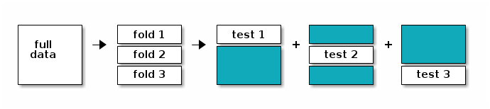

After cross-validation, all models used within each fold are
discarded, and a new model is built using the whole dataset, with the
best model parameter(s), i.e those that generalised over all folds.

This makes cross-validation quite time consuming, as it takes *x+1*
(where *x* in the number of cross-validation folds) times as long as
fitting a single model, but is essential.

Note that it is important to maintain the class proportions within the
different folds, i.e. respect the proportion of the different classes
in the original data. This is also taken care when using the
*[caret](https://CRAN.R-project.org/package=caret)* package.


The procedure of creating folds and training the models is handled by
the `train` function in *[caret](https://CRAN.R-project.org/package=caret)*. Below, we apply it to
the diamond price example that we used when introducing the model
performance.

- We start by setting a random seed to be able to reproduce the example.
- We specify the method (the learning algorithm) we want to use. Here,
  we use `"lm"`, but, as we will see later, there are many others to
  choose from[^1].
- We then set the out-of-sample training procedure to 10-fold cross
  validation (`method = "cv"` and `number = 10`). To simplify the
  output in the material for better readability, we set the verbosity
  flag to `FALSE`, but it is useful to set it to `TRUE` in interactive
  mode.

[^1]: There are exactly 238 available
    methods. See
    http://topepo.github.io/caret/train-models-by-tag.html for
    details.


```r
set.seed(42)
model <- train(price ~ ., diamonds,
               method = "lm",
               trControl = trainControl(method = "cv",
                                        number = 10,
                                        verboseIter = FALSE))
model
```

```
## Linear Regression 
## 
## 53940 samples
##     9 predictor
## 
## No pre-processing
## Resampling: Cross-Validated (10 fold) 
## Summary of sample sizes: 48547, 48545, 48546, 48545, 48546, 48546, ... 
## Resampling results:
## 
##   RMSE      Rsquared   MAE     
##   1130.819  0.9197489  740.5712
## 
## Tuning parameter 'intercept' was held constant at a value of TRUE
```

Once we have trained our model, we can directly use this `train`
object as input to the `predict` method:


```r
p <- predict(model, diamonds)
error <- p - diamonds$price
rmse_xval <- sqrt(mean(error^2)) ## xval RMSE
rmse_xval
```

```
## [1] 1129.843
```

> Challenge
>
> Train a linear model using 10-fold cross-validation and then use it
> to predict the median value of owner-occupied homes in Boston from
> the `Boston` dataset as described above. Then calculate the RMSE.


<details>

```r
library("MASS")
data(Boston)
model <- train(medv ~ .,
               Boston,
               method = "lm",
               trControl = trainControl(method = "cv",
                                        number = 10))
model
```

```
## Linear Regression 
## 
## 506 samples
##  13 predictor
## 
## No pre-processing
## Resampling: Cross-Validated (10 fold) 
## Summary of sample sizes: 455, 456, 457, 456, 454, 456, ... 
## Resampling results:
## 
##   RMSE      Rsquared   MAE     
##   4.838479  0.7301286  3.433261
## 
## Tuning parameter 'intercept' was held constant at a value of TRUE
```

```r
p <- predict(model, Boston)
sqrt(mean(p - Boston$medv)^2)
```

```
## [1] 6.647482e-14
```
</details>

## Classification performance

Above, we have used the RMSE to assess the performance of our
regression model. When using a classification algorithm, we want to
assess its accuracy to do so.

### Confusion matrix

Instead of calculating an error between predicted value and known
value, in classification we will directly compare the predicted
class matches with the known label. To do so, rather than calculating the
mean accuracy as we did above, in the introductory kNN example, we can
calculate a **confusion matrix**.

A confusion matrix contrasts predictions to actual results. Correct
results are *true positives* (TP) and *true negatives* (TN) are found
along the diagonal. All other cells indicate false results, i.e *false
negatives* (FN) and *false positives* (FP).


                Reference Yes   Reference No 
--------------  --------------  -------------
Predicted Yes   TP              FP           
Predicted No    FN              TN           

The values that populate this table will depend on the cutoff that
we set to define whether the classifier should predict *Yes* or
*No*. Intuitively, we might want to use 0.5 as a threshold, and assign
every result with a probability > 0.5 to *Yes* and *No* otherwise.

Let's experiment with this using the `Sonar` dataset, and see if we
can differentiate mines from rocks using a logistic classification
model use the `glm` function from the *[stats](https://CRAN.R-project.org/package=stats)* package.


```r
library("mlbench")
data(Sonar)
## 60/40 split
tr <- sample(nrow(Sonar), round(nrow(Sonar) * 0.6))
train <- Sonar[tr, ]
test <- Sonar[-tr, ]
```


```r
model <- glm(Class ~ ., data = train, family = "binomial")
p <- predict(model, test, type = "response")
summary(p)
```

```
##    Min. 1st Qu.  Median    Mean 3rd Qu.    Max. 
##  0.0000  0.0000  0.8545  0.5123  1.0000  1.0000
```


```r
cl <- ifelse(p > 0.5, "M", "R")
table(cl, test$Class)
```

```
##    
## cl   M  R
##   M 12 31
##   R 31  9
```

The caret package offers its own, more informative function to
calculate a confusion matrix:


```r
confusionMatrix(factor(cl), test$Class)
```

```
## Confusion Matrix and Statistics
## 
##           Reference
## Prediction  M  R
##          M 12 31
##          R 31  9
##                                           
##                Accuracy : 0.253           
##                  95% CI : (0.1639, 0.3604)
##     No Information Rate : 0.5181          
##     P-Value [Acc > NIR] : 1               
##                                           
##                   Kappa : -0.4959         
##                                           
##  Mcnemar's Test P-Value : 1               
##                                           
##             Sensitivity : 0.2791          
##             Specificity : 0.2250          
##          Pos Pred Value : 0.2791          
##          Neg Pred Value : 0.2250          
##              Prevalence : 0.5181          
##          Detection Rate : 0.1446          
##    Detection Prevalence : 0.5181          
##       Balanced Accuracy : 0.2520          
##                                           
##        'Positive' Class : M               
## 
```

We get, among others

- the accuracy: $\frac{TP + TN}{TP + TN + FP + FN}$
- the sensitivity (recall, TP rate): $\frac{TP}{TP + FN}$
- the specificity: $\frac{TN}{TN + FP}$
- positive predictive value (precision): $\frac{TP}{TP + FP}$
- negative predictive value: $\frac{TN}{TN + FN}$
- FP rate (fall-out): $\frac{FP}{FP + TN}$

> Challenge
>
> Compare the model accuracy (or any other metric) using thresholds of
> 0.1 and 0.9.

<details>

```r
confusionMatrix(factor(ifelse(p > 0.9, "M", "R")), test$Class)
```

```
## Confusion Matrix and Statistics
## 
##           Reference
## Prediction  M  R
##          M 11 30
##          R 32 10
##                                           
##                Accuracy : 0.253           
##                  95% CI : (0.1639, 0.3604)
##     No Information Rate : 0.5181          
##     P-Value [Acc > NIR] : 1.0000          
##                                           
##                   Kappa : -0.4933         
##                                           
##  Mcnemar's Test P-Value : 0.8989          
##                                           
##             Sensitivity : 0.2558          
##             Specificity : 0.2500          
##          Pos Pred Value : 0.2683          
##          Neg Pred Value : 0.2381          
##              Prevalence : 0.5181          
##          Detection Rate : 0.1325          
##    Detection Prevalence : 0.4940          
##       Balanced Accuracy : 0.2529          
##                                           
##        'Positive' Class : M               
## 
```

```r
confusionMatrix(factor(ifelse(p > 0.1, "M", "R")), test$Class)
```

```
## Confusion Matrix and Statistics
## 
##           Reference
## Prediction  M  R
##          M 12 31
##          R 31  9
##                                           
##                Accuracy : 0.253           
##                  95% CI : (0.1639, 0.3604)
##     No Information Rate : 0.5181          
##     P-Value [Acc > NIR] : 1               
##                                           
##                   Kappa : -0.4959         
##                                           
##  Mcnemar's Test P-Value : 1               
##                                           
##             Sensitivity : 0.2791          
##             Specificity : 0.2250          
##          Pos Pred Value : 0.2791          
##          Neg Pred Value : 0.2250          
##              Prevalence : 0.5181          
##          Detection Rate : 0.1446          
##    Detection Prevalence : 0.5181          
##       Balanced Accuracy : 0.2520          
##                                           
##        'Positive' Class : M               
## 
```
</details>

### Receiver operating characteristic (ROC) curve

There is no reason to use 0.5 as a threshold. One could use a low
threshold to catch more mines with less certainty or or higher
threshold to catch fewer mines with more certainty.

This illustrates the need to adequately balance TP and FP rates. We
need to have a way to do a cost-benefit analysis, and the solution
will often depend on the question/problem.

One solution would be to try with different classification
thresholds. Instead of inspecting numerous confusion matrices, it is
possible to automate the calculation of the TP and FP rates at each
threshold and visualise all results along a ROC curve.

This can be done with the `colAUC` function from the
*[caTools](https://CRAN.R-project.org/package=caTools)* package:


```r
caTools::colAUC(p, test[["Class"]], plotROC = TRUE)
```

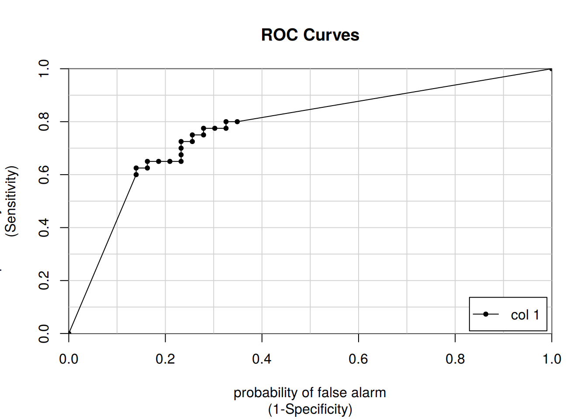

```
##              [,1]
## M vs. R 0.7767442
```

- x: FP rate (1 - specificity)
- y: TP rate (sensitivity)
- each point along the curve represents a confusion matrix for a given
  threshold

In addition, the `colAUC` function returns the area under the curve
(AUC) model accuracy metric. This is single number metric, summarising
the model performance along all possible thresholds:

- an AUC of 0.5 corresponds to a random model
- values > 0.5 do better than a random guess
- a value of 1 represents a perfect model
- a value 0 represents a model that is always wrong

### AUC in `caret`

When using *[caret](https://CRAN.R-project.org/package=caret)*'s `trainControl` function to train a
model, we can set it so that it computes the ROC and AUC properties
for us.


```r
## Create trainControl object: myControl
myControl <- trainControl(
    method = "cv", ## cross validation
    number = 10,   ## 10-fold
    summaryFunction = twoClassSummary, ## NEW
    classProbs = TRUE, # IMPORTANT
    verboseIter = FALSE
)
## Train glm with custom trainControl: model
model <- train(Class ~ ., Sonar,
               method = "glm", ## to use glm's logistic regression
               trControl = myControl)

## Print model to console
print(model)
```

```
## Generalized Linear Model 
## 
## 208 samples
##  60 predictor
##   2 classes: 'M', 'R' 
## 
## No pre-processing
## Resampling: Cross-Validated (10 fold) 
## Summary of sample sizes: 187, 188, 188, 187, 188, 187, ... 
## Resampling results:
## 
##   ROC       Sens       Spec     
##   0.733447  0.7477273  0.6688889
```

> Challenge
>
> Define a `train` object that uses the AUC and 10-fold cross
> validation to classify the Sonar data using a logistic regression,
> as demonstrated above.

## Random forest

Random forest models are accurate and non-linear models and robust to
over-fitting and hence quite popular. They however require
hyperparameters to be tuned manually, like the value *k* in the
example above.

Building a random forest starts by generating a high number of
individual decision trees. A single decision tree isn't very accurate,
but many different trees built using different inputs (with
bootstrapped inputs, features and observations) enable us to explore a
broad search space and, once combined, produce accurate models, a
technique called *bootstrap aggregation* or *bagging*.

### Decision trees

A great advantage of decision trees is that they make a complex
decision simpler by breaking it down into smaller, simpler decisions
using a divide-and-conquer strategy. They basically identify a set of
if-else conditions that split the data according to the value of the
features.


```r
library("rpart") ## recursive partitioning
m <- rpart(Class ~ ., data = Sonar,
           method = "class")
library("rpart.plot")
rpart.plot(m)
```

<div class="figure">
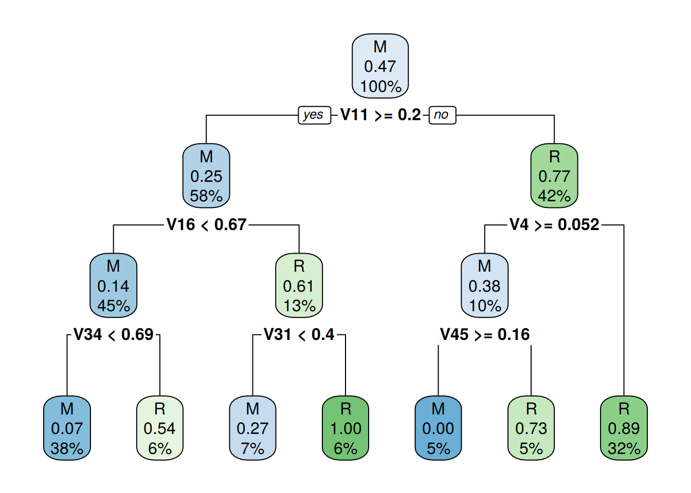
<p class="caption">(\#fig:rpart)Descision tree with its if-else conditions</p>
</div>

```r
p <- predict(m, Sonar, type = "class")
table(p, Sonar$Class)
```

```
##    
## p    M  R
##   M 95 10
##   R 16 87
```

Decision trees choose splits based on most homogeneous partitions, and
lead to smaller and more homogeneous partitions over their iterations.

An issue with single decision trees is that they can grow, and become
large and complex with many branches, which corresponds to
over-fitting. Over-fitting models noise, rather than general patterns in
the data, focusing on subtle patterns (outliers) that won't
generalise.

To avoid over-fitting, individual decision trees are pruned. Pruning
can happen as a pre-condition when growing the tree, or afterwards, by
pruning a large tree.

- *Pre-pruning*: stop growing process, i.e stops divide-and-conquer
  after a certain number of iterations (grows tree to a certain
  predefined level), or requires a minimum number of observations in
  each mode to allow splitting.

- *Post-pruning*: grow a large and complex tree, and reduce its size;
  nodes and branches that have a negligible effect on the
  classification accuracy are removed.

### Training a random forest

Let's return to random forests and train a model using the `train`
function from *[caret](https://CRAN.R-project.org/package=caret)*:


```r
set.seed(12)
model <- train(Class ~ .,
               data = Sonar,
               method = "ranger")
print(model)
```

```
## Random Forest 
## 
## 208 samples
##  60 predictor
##   2 classes: 'M', 'R' 
## 
## No pre-processing
## Resampling: Bootstrapped (25 reps) 
## Summary of sample sizes: 208, 208, 208, 208, 208, 208, ... 
## Resampling results across tuning parameters:
## 
##   mtry  splitrule   Accuracy   Kappa    
##    2    gini        0.8090731  0.6131571
##    2    extratrees  0.8136902  0.6234492
##   31    gini        0.7736954  0.5423516
##   31    extratrees  0.8285153  0.6521921
##   60    gini        0.7597299  0.5140905
##   60    extratrees  0.8157646  0.6255929
## 
## Tuning parameter 'min.node.size' was held constant at a value of 1
## Accuracy was used to select the optimal model using the largest value.
## The final values used for the model were mtry = 31, splitrule =
##  extratrees and min.node.size = 1.
```


```r
plot(model)
```

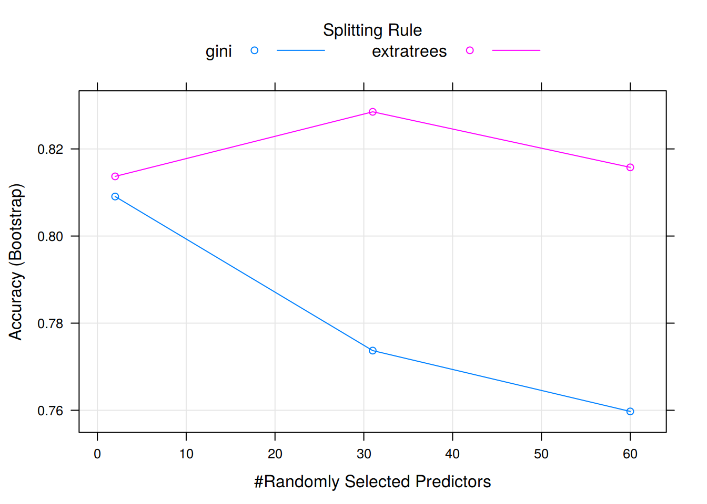

The main hyperparameter is *mtry*, i.e. the number of randomly selected
variables used at each split. Two variables produce random models, while
hundreds of variables tend to be less random, but risk
over-fitting. The `caret` package can automate the tuning of the hyperparameter using a
**grid search**, which can be parametrised by setting `tuneLength`
(that sets the number of hyperparameter values to test) or directly
defining the `tuneGrid` (the hyperparameter values), which requires
knowledge of the model.


```r
model <- train(Class ~ .,
               data = Sonar,
               method = "ranger",
               tuneLength = 5)
```


```r
set.seed(42)
myGrid <- expand.grid(mtry = c(5, 10, 20, 40, 60),
                      splitrule = c("gini", "extratrees"),
                      min.node.size = 1) ## Minimal node size; default 1 for classification
model <- train(Class ~ .,
               data = Sonar,
               method = "ranger",
               tuneGrid = myGrid,
               trControl = trainControl(method = "cv",
                                       number = 5,
                                       verboseIter = FALSE))
print(model)
```

```
## Random Forest 
## 
## 208 samples
##  60 predictor
##   2 classes: 'M', 'R' 
## 
## No pre-processing
## Resampling: Cross-Validated (5 fold) 
## Summary of sample sizes: 166, 167, 167, 167, 165 
## Resampling results across tuning parameters:
## 
##   mtry  splitrule   Accuracy   Kappa    
##    5    gini        0.8076277  0.6098253
##    5    extratrees  0.8416579  0.6784745
##   10    gini        0.7927667  0.5799348
##   10    extratrees  0.8418848  0.6791453
##   20    gini        0.7882316  0.5718852
##   20    extratrees  0.8516355  0.6991879
##   40    gini        0.7880048  0.5716461
##   40    extratrees  0.8371229  0.6695638
##   60    gini        0.7833482  0.5613525
##   60    extratrees  0.8322448  0.6599318
## 
## Tuning parameter 'min.node.size' was held constant at a value of 1
## Accuracy was used to select the optimal model using the largest value.
## The final values used for the model were mtry = 20, splitrule =
##  extratrees and min.node.size = 1.
```

```r
plot(model)
```

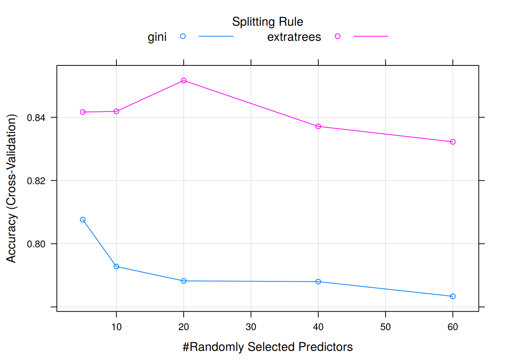

> Challenge
>
> Experiment with training a random forest model as described above,
> by using 5-fold cross validation, and setting a `tuneLength` of 5.

<details>

```r
set.seed(42)
model <- train(Class ~ .,
               data = Sonar,
               method = "ranger",
               tuneLength = 5,
               trControl = trainControl(method = "cv",
                                        number = 5,
                                        verboseIter = FALSE))
plot(model)
```

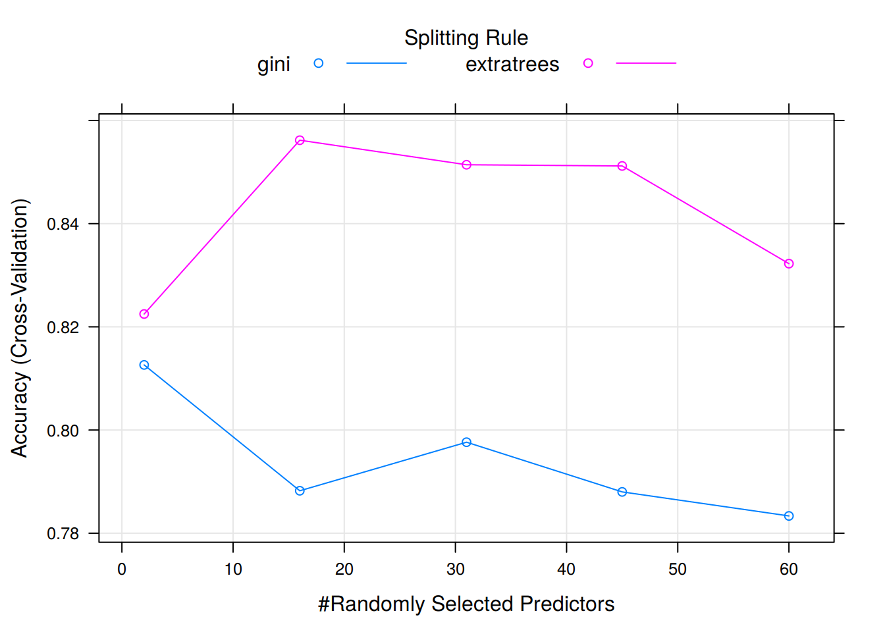
</details>

## Data pre-processing

### Missing values

Real datasets often come with missing values. In R, these should be
encoded using `NA`. There are basically two approaches to deal with
such cases.

- Drop the observations with missing values, or, if one feature
  contains a very high proportion of NAs, drop the feature
  altogether. These approaches are only applicable when the proportion
  of missing values is relatively small. Otherwise, it could lead to
  losing too much data.

- Impute (replace) missing values.

Data imputation can however have critical consequences depending on the
proportion of missing values and their nature. From a statistical
point of view, missing values are classified as *missing completely at
random* (MCAR), *missing at random* (MAR) or *missing not at random*
(MNAR), and the type of the missing values will influence the
efficiency of the imputation method.

The figure below shows how different imputation methods perform
depending on the proportion and nature of missing values
(from [Lazar *et al.*](https://www.ncbi.nlm.nih.gov/pubmed/26906401),
on quantitative proteomics data).

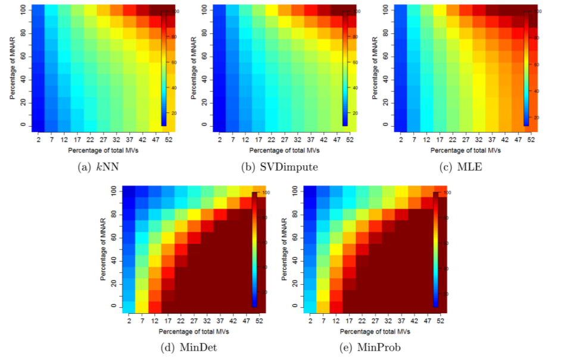


Let's start by simulating a dataset containing missing values using
the `mtcars` dataset. Below, we will want to predict the `mpg`
variable using `cyl`, `disp`, and `hp`, with the latter containing 10
missing values.


```r
data(mtcars)
mtcars[sample(nrow(mtcars), 10), "hp"] <- NA
Y <- mtcars$mpg    ## target variable
X <- mtcars[, 2:4] ## predictors
```

If we now wanted to train a model (using the non-formula interface):


```r
try(train(X, Y))
```

```
## note: only 2 unique complexity parameters in default grid. Truncating the grid to 2 .
## 
## Something is wrong; all the RMSE metric values are missing:
##       RMSE        Rsquared        MAE     
##  Min.   : NA   Min.   : NA   Min.   : NA  
##  1st Qu.: NA   1st Qu.: NA   1st Qu.: NA  
##  Median : NA   Median : NA   Median : NA  
##  Mean   :NaN   Mean   :NaN   Mean   :NaN  
##  3rd Qu.: NA   3rd Qu.: NA   3rd Qu.: NA  
##  Max.   : NA   Max.   : NA   Max.   : NA  
##  NA's   :2     NA's   :2     NA's   :2    
## Error : Stopping
```

(Note that the occurrence of the error will depend on the model
chosen.)

We could perform imputation manually, but *[caret](https://CRAN.R-project.org/package=caret)*
provides a whole range of pre-processing methods, including imputation
methods, that can directly be passed when training the model.

### Median imputation

Imputation using median of features. This method works well if the
data are missing at random.


```r
train(X, Y, preProcess = "medianImpute")
```

```
## note: only 2 unique complexity parameters in default grid. Truncating the grid to 2 .
```

```
## Random Forest 
## 
## 32 samples
##  3 predictor
## 
## Pre-processing: median imputation (3) 
## Resampling: Bootstrapped (25 reps) 
## Summary of sample sizes: 32, 32, 32, 32, 32, 32, ... 
## Resampling results across tuning parameters:
## 
##   mtry  RMSE      Rsquared   MAE     
##   2     2.345716  0.8457441  1.923509
##   3     2.433508  0.8337201  2.007780
## 
## RMSE was used to select the optimal model using the smallest value.
## The final value used for the model was mtry = 2.
```

Imputing using caret also allows us to optimise the imputation based on
the cross validation splits, as `train` will do median imputation
inside each fold.

### kNN imputation

If there is a systematic bias in the missing values, then median
imputation is known to produce incorrect results. kNN imputation will
impute missing values using other, similar non-missing rows. The
default value is 5.


```r
train(X, Y, preProcess = "knnImpute")
```

```
## note: only 2 unique complexity parameters in default grid. Truncating the grid to 2 .
```

```
## Random Forest 
## 
## 32 samples
##  3 predictor
## 
## Pre-processing: nearest neighbor imputation (3), centered (3), scaled (3) 
## Resampling: Bootstrapped (25 reps) 
## Summary of sample sizes: 32, 32, 32, 32, 32, 32, ... 
## Resampling results across tuning parameters:
## 
##   mtry  RMSE      Rsquared   MAE     
##   2     2.603630  0.8300018  2.145504
##   3     2.635956  0.8228652  2.171091
## 
## RMSE was used to select the optimal model using the smallest value.
## The final value used for the model was mtry = 2.
```

## Scaling and centering

We have seen in the *Unsupervised learning* chapter how data at
different scales can substantially disrupt a learning
algorithm. Scaling (division by the standard deviation) and centering
(subtraction of the mean) can also be applied directly during model
training by setting. Note that they are set to be applied by default
prior to training.


```r
train(X, Y, preProcess = "scale")
train(X, Y, preProcess = "center")
```

As we have discussed in the section on Principal Component
Analysis, PCA can be used as pre-processing method, generating a set
of high-variance and perpendicular predictors, preventing
collinearity.


```r
train(X, Y, preProcess = "pca")
```

### Multiple pre-processing methods

It is possible to chain multiple processing methods: imputation,
center, scale, pca.


```r
train(X, Y, preProcess = c("knnImpute", "center", "scale", "pca"))
```

```
## note: only 2 unique complexity parameters in default grid. Truncating the grid to 2 .
```

```
## Random Forest 
## 
## 32 samples
##  3 predictor
## 
## Pre-processing: nearest neighbor imputation (3), centered (3), scaled
##  (3), principal component signal extraction (3) 
## Resampling: Bootstrapped (25 reps) 
## Summary of sample sizes: 32, 32, 32, 32, 32, 32, ... 
## Resampling results across tuning parameters:
## 
##   mtry  RMSE      Rsquared   MAE     
##   2     2.549263  0.8245732  2.125463
##   3     2.553001  0.8256242  2.131125
## 
## RMSE was used to select the optimal model using the smallest value.
## The final value used for the model was mtry = 2.
```

The pre-processing methods above represent a classical order of
operations, starting with data imputation to remove missing values,
then centering and scaling, prior to PCA.

<!-- ## Low information predictors -->

<!-- To remove, for example constant or random variables, or variables with -->
<!-- low variance. -->

<!-- ```{r, eval=FALSE} -->
<!-- train(X, Y, preProcess = c("zv", ...))  ## remove constant (zero-variance) columns -->
<!-- train(X, Y, preProcess = c("nzv", ...)) ## nearly constant columns -->
<!-- ``` -->

For further details, see `?preProcess`.

## Model selection

In this final section, we are going to compare different predictive
models and choose the best one using the tools presented in the
previous sections.

To to so, we are going to first create a set of common training
controller object with the same train/test folds and model evaluation
metrics that we will re-use. This is important to guarantee fair
comparison between the different models.

For this section, we are going to use the `churn` data. Below, we see
that about 15% of the customers churn. It is important to maintain
this proportion in all of the folds.


```r
library("C50")
data(churn)
table(churnTrain$churn)/nrow(churnTrain)
```

```
## 
##       yes        no 
## 0.1449145 0.8550855
```

Previously, when creating a train control object, we specified the
method as `"cv"` and the number of folds. Now, as we want the same
folds to be re-used over multiple model training rounds, we are going
to pass the train/test splits directly. These splits are created with
the `createFolds` function, which creates a list (here of length 5)
containing the element indices for each fold.


```r
myFolds <- createFolds(churnTrain$churn, k = 5)
str(myFolds)
```

```
## List of 5
##  $ Fold1: int [1:667] 3 7 13 17 20 36 39 48 52 62 ...
##  $ Fold2: int [1:667] 4 10 12 24 25 29 41 42 47 50 ...
##  $ Fold3: int [1:667] 6 15 19 21 22 26 28 32 33 34 ...
##  $ Fold4: int [1:666] 5 9 16 30 31 37 44 45 46 53 ...
##  $ Fold5: int [1:666] 1 2 8 11 14 18 23 27 35 43 ...
```

> Challenge
>
> Verify that the folds maintain the proportion of yes/no results.

<details>

```r
sapply(myFolds, function(i) {
    table(churnTrain$churn[i])/length(i)
})
```

```
##         Fold1     Fold2     Fold3     Fold4     Fold5
## yes 0.1454273 0.1454273 0.1454273 0.1441441 0.1441441
## no  0.8545727 0.8545727 0.8545727 0.8558559 0.8558559
```
</details>

We can now a train control object to be reused consistently for
different model trainings.


```r
myControl <- trainControl(
  summaryFunction = twoClassSummary,
  classProb = TRUE,
  verboseIter = FALSE,
  savePredictions = TRUE,
  index = myFolds
)
```

### `glmnet` model

The `glmnet` is a linear model with built-in variable selection and
coefficient regularisation.


```r
glm_model <- train(churn ~ .,
                   churnTrain,
                   metric = "ROC",
                   method = "glmnet",
                   tuneGrid = expand.grid(
                       alpha = 0:1,
                       lambda = 0:10/10),
                   trControl = myControl)
print(glm_model)
```

```
## glmnet 
## 
## 3333 samples
##   19 predictor
##    2 classes: 'yes', 'no' 
## 
## No pre-processing
## Resampling: Bootstrapped (5 reps) 
## Summary of sample sizes: 667, 667, 667, 666, 666 
## Resampling results across tuning parameters:
## 
##   alpha  lambda  ROC        Sens         Spec     
##   0      0.0     0.7575175  0.249475840  0.9567544
##   0      0.1     0.7769689  0.070920191  0.9921053
##   0      0.2     0.7785410  0.016561567  0.9986842
##   0      0.3     0.7784171  0.004659196  0.9994737
##   0      0.4     0.7780007  0.000000000  1.0000000
##   0      0.5     0.7775646  0.000000000  1.0000000
##   0      0.6     0.7771289  0.000000000  1.0000000
##   0      0.7     0.7767893  0.000000000  1.0000000
##   0      0.8     0.7764375  0.000000000  1.0000000
##   0      0.9     0.7761664  0.000000000  1.0000000
##   0      1.0     0.7759360  0.000000000  1.0000000
##   1      0.0     0.7200047  0.291397893  0.9434211
##   1      0.1     0.5216114  0.000000000  1.0000000
##   1      0.2     0.5000000  0.000000000  1.0000000
##   1      0.3     0.5000000  0.000000000  1.0000000
##   1      0.4     0.5000000  0.000000000  1.0000000
##   1      0.5     0.5000000  0.000000000  1.0000000
##   1      0.6     0.5000000  0.000000000  1.0000000
##   1      0.7     0.5000000  0.000000000  1.0000000
##   1      0.8     0.5000000  0.000000000  1.0000000
##   1      0.9     0.5000000  0.000000000  1.0000000
##   1      1.0     0.5000000  0.000000000  1.0000000
## 
## ROC was used to select the optimal model using the largest value.
## The final values used for the model were alpha = 0 and lambda = 0.2.
```

```r
plot(glm_model)
```

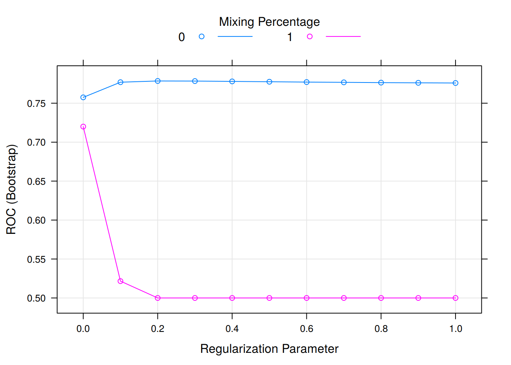


Below, we are going to repeat this same modelling with a variety of
different classifiers, some of which we haven't looked at. This
illustrates another advantage of of using **meta-packages** such as
*[caret](https://CRAN.R-project.org/package=caret)*, that provide a consistant interface to different
backends (in this case for machine learning). Once we have mastered
the interface, it becomes easy to apply it to a new backend.

Note that some of the model training below will take some time to run,
depending on the tuning parameter settings.

### random forest model

> Challenge
>
> Apply a random forest model, making sure you reuse the same train
> control object.

<details>

```r
rf_model <- train(churn ~ .,
                  churnTrain,
                  metric = "ROC",
                  method = "ranger",
                  tuneGrid = expand.grid(
                      mtry = c(2, 5, 10, 19),
                      splitrule = c("gini", "extratrees"),
                      min.node.size = 1),
                  trControl = myControl)
print(rf_model)
```

```
## Random Forest 
## 
## 3333 samples
##   19 predictor
##    2 classes: 'yes', 'no' 
## 
## No pre-processing
## Resampling: Bootstrapped (5 reps) 
## Summary of sample sizes: 667, 666, 667, 667, 666 
## Resampling results across tuning parameters:
## 
##   mtry  splitrule   ROC        Sens        Spec     
##    2    gini        0.8691497  0.03419421  0.9999123
##    2    extratrees  0.8313459  0.00000000  1.0000000
##    5    gini        0.8873821  0.22153405  0.9964912
##    5    extratrees  0.8709519  0.05126454  0.9999123
##   10    gini        0.8963874  0.40527239  0.9910526
##   10    extratrees  0.8872401  0.21374463  0.9980702
##   19    gini        0.8999424  0.59368866  0.9833333
##   19    extratrees  0.8942471  0.36641898  0.9918421
## 
## Tuning parameter 'min.node.size' was held constant at a value of 1
## ROC was used to select the optimal model using the largest value.
## The final values used for the model were mtry = 19, splitrule = gini
##  and min.node.size = 1.
```

```r
plot(rf_model)
```

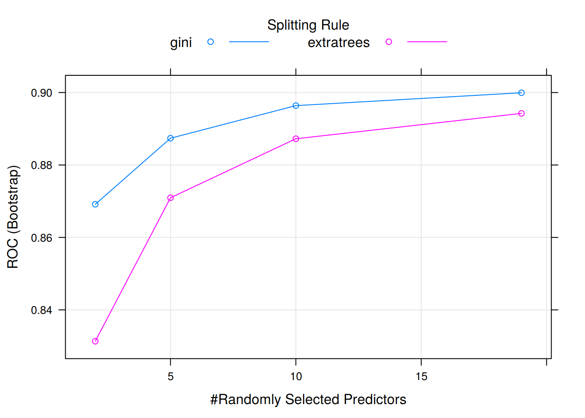
</details>

### kNN model

> Challenge
>
> Apply a kNN model, making sure you reuse the same train
> control object.

<details>

```r
knn_model <- train(churn ~ .,
                   churnTrain,
                   metric = "ROC",
                   method = "knn",
                   tuneLength = 20,
                   trControl = myControl)
print(knn_model)
```

```
## k-Nearest Neighbors 
## 
## 3333 samples
##   19 predictor
##    2 classes: 'yes', 'no' 
## 
## No pre-processing
## Resampling: Bootstrapped (5 reps) 
## Summary of sample sizes: 667, 666, 667, 667, 666 
## Resampling results across tuning parameters:
## 
##   k   ROC        Sens        Spec     
##    5  0.6663254  0.21375668  0.9801754
##    7  0.6810784  0.19358022  0.9872807
##    9  0.6876778  0.17545889  0.9907895
##   11  0.6913460  0.16304106  0.9927193
##   13  0.6901065  0.15165147  0.9941228
##   15  0.6938565  0.14700566  0.9950000
##   17  0.6936872  0.13148037  0.9958772
##   19  0.6968690  0.11905986  0.9961404
##   21  0.6990429  0.10767295  0.9971930
##   23  0.7013093  0.10301777  0.9971053
##   25  0.7038638  0.09214229  0.9976316
##   27  0.7034258  0.08334204  0.9982456
##   29  0.7061759  0.07454847  0.9981579
##   31  0.7050670  0.06885301  0.9985088
##   33  0.7048892  0.06316156  0.9985088
##   35  0.7059717  0.05746743  0.9986842
##   37  0.7061809  0.04711679  0.9992105
##   39  0.7062836  0.04297171  0.9991228
##   41  0.7064347  0.03831519  0.9991228
##   43  0.7056465  0.03520638  0.9992982
## 
## ROC was used to select the optimal model using the largest value.
## The final value used for the model was k = 41.
```

```r
plot(knn_model)
```

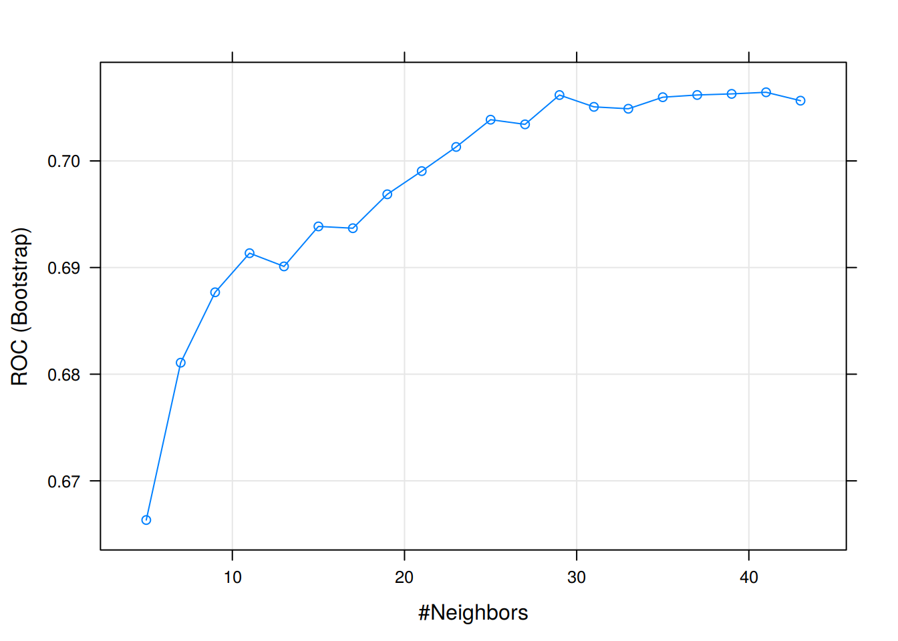
</details>

### Support vector machine model

> Challenge
>
> Apply a svm model, making sure you reuse the same train control
> object. Hint: Look at `names(getModelInfo())` for all possible model
> names.

<details>

```r
svm_model <- train(churn ~ .,
                   churnTrain,
                   metric = "ROC",
                   method = "svmRadial",
                   tuneLength = 10,
                   trControl = myControl)
print(svm_model)
```

```
## Support Vector Machines with Radial Basis Function Kernel 
## 
## 3333 samples
##   19 predictor
##    2 classes: 'yes', 'no' 
## 
## No pre-processing
## Resampling: Bootstrapped (5 reps) 
## Summary of sample sizes: 667, 666, 667, 667, 666 
## Resampling results across tuning parameters:
## 
##   C       ROC        Sens       Spec     
##     0.25  0.8076274  0.1324470  0.9890351
##     0.50  0.8075759  0.1386847  0.9889474
##     1.00  0.8076122  0.1692386  0.9856140
##     2.00  0.8077675  0.1448689  0.9878070
##     4.00  0.8118208  0.1770227  0.9871053
##     8.00  0.8163109  0.1950757  0.9841228
##    16.00  0.8104749  0.1899091  0.9828070
##    32.00  0.8045082  0.1738576  0.9839474
##    64.00  0.8001100  0.1464661  0.9864912
##   128.00  0.7994143  0.1676480  0.9827193
## 
## Tuning parameter 'sigma' was held constant at a value of 0.007394083
## ROC was used to select the optimal model using the largest value.
## The final values used for the model were sigma = 0.007394083 and C = 8.
```

```r
plot(svm_model)
```

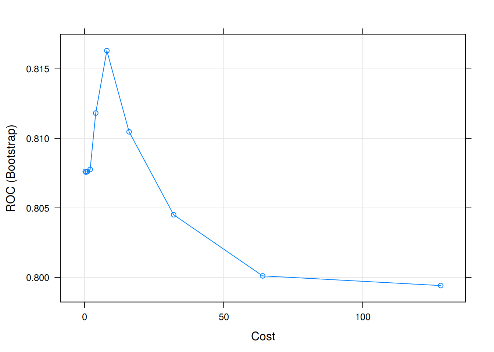
</details>

### Naive Bayes

> Challenge
>
> Apply a naive Bayes model, making sure you reuse the same train
> control object.

<details>

```r
nb_model <- train(churn ~ .,
                  churnTrain,
                  metric = "ROC",
                  method = "naive_bayes",
                  trControl = myControl)

print(nb_model)
```

```
## Naive Bayes 
## 
## 3333 samples
##   19 predictor
##    2 classes: 'yes', 'no' 
## 
## No pre-processing
## Resampling: Bootstrapped (5 reps) 
## Summary of sample sizes: 667, 667, 667, 666, 666 
## Resampling results across tuning parameters:
## 
##   usekernel  ROC        Sens       Spec      
##   FALSE      0.5540359  0.9497409  0.07912281
##    TRUE      0.8086525  0.0000000  1.00000000
## 
## Tuning parameter 'laplace' was held constant at a value of 0
## 
## Tuning parameter 'adjust' was held constant at a value of 1
## ROC was used to select the optimal model using the largest value.
## The final values used for the model were laplace = 0, usekernel = TRUE
##  and adjust = 1.
```

```r
plot(nb_model)
```

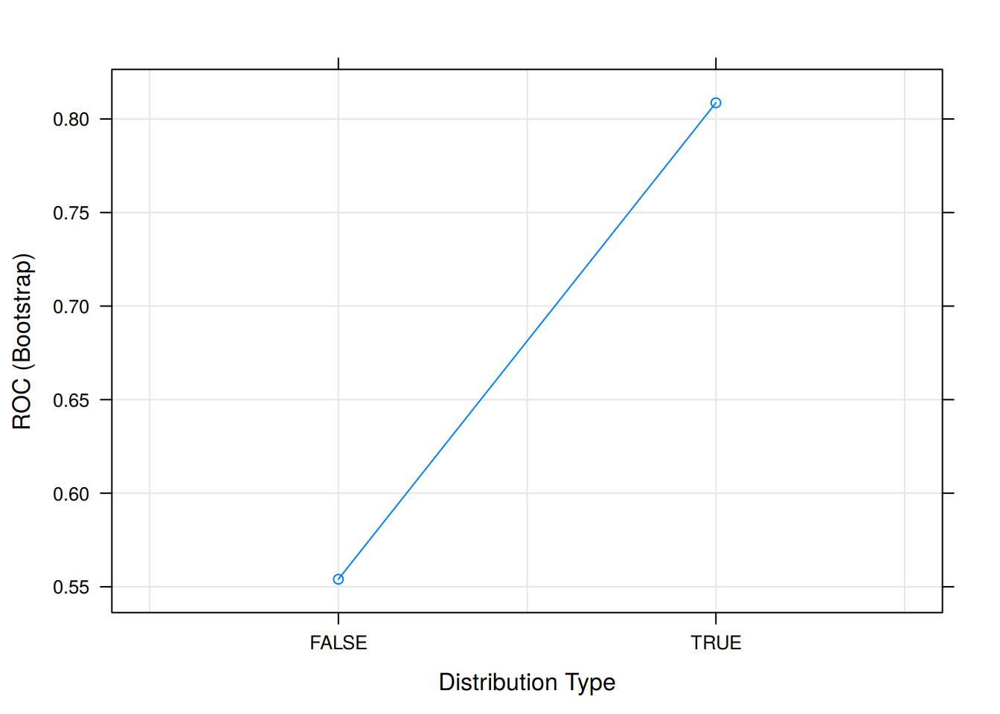
</details>

### Comparing models

We can now use the `caret::resamples` function that will compare the
models and pick the one with the highest AUC and lowest AUC standard
deviation.


```r
model_list <- list(glmmet = glm_model,
                   rf = rf_model,
                   knn = knn_model,
                   svm = svm_model,
                   nb = nb_model)
resamp <- resamples(model_list)
resamp
```

```
## 
## Call:
## resamples.default(x = model_list)
## 
## Models: glmmet, rf, knn, svm, nb 
## Number of resamples: 5 
## Performance metrics: ROC, Sens, Spec 
## Time estimates for: everything, final model fit
```

```r
summary(resamp)
```

```
## 
## Call:
## summary.resamples(object = resamp)
## 
## Models: glmmet, rf, knn, svm, nb 
## Number of resamples: 5 
## 
## ROC 
##             Min.   1st Qu.    Median      Mean   3rd Qu.      Max. NA's
## glmmet 0.7739183 0.7755329 0.7801770 0.7785410 0.7813153 0.7817614    0
## rf     0.8930595 0.8999960 0.9003610 0.8999424 0.9016521 0.9046433    0
## knn    0.6968770 0.7006795 0.7059823 0.7064347 0.7078999 0.7207347    0
## svm    0.8091833 0.8157088 0.8161544 0.8163109 0.8174223 0.8230858    0
## nb     0.7954270 0.8004363 0.8118887 0.8086525 0.8157215 0.8197891    0
## 
## Sens 
##               Min.    1st Qu.     Median       Mean    3rd Qu.       Max.
## glmmet 0.007772021 0.01291990 0.01813472 0.01656157 0.02072539 0.02325581
## rf     0.551813472 0.58914729 0.59173127 0.59368866 0.59844560 0.63730570
## knn    0.012919897 0.02072539 0.03875969 0.03831519 0.04663212 0.07253886
## svm    0.062176166 0.16839378 0.20671835 0.19507571 0.24093264 0.29715762
## nb     0.000000000 0.00000000 0.00000000 0.00000000 0.00000000 0.00000000
##        NA's
## glmmet    0
## rf        0
## knn       0
## svm       0
## nb        0
## 
## Spec 
##             Min.   1st Qu.    Median      Mean   3rd Qu.      Max. NA's
## glmmet 0.9973684 0.9982456 0.9986842 0.9986842 0.9991228 1.0000000    0
## rf     0.9750000 0.9824561 0.9837719 0.9833333 0.9868421 0.9885965    0
## knn    0.9978070 0.9986842 0.9991228 0.9991228 1.0000000 1.0000000    0
## svm    0.9644737 0.9828947 0.9846491 0.9841228 0.9903509 0.9982456    0
## nb     1.0000000 1.0000000 1.0000000 1.0000000 1.0000000 1.0000000    0
```


```r
lattice::bwplot(resamp, metric = "ROC")
```

<div class="figure">
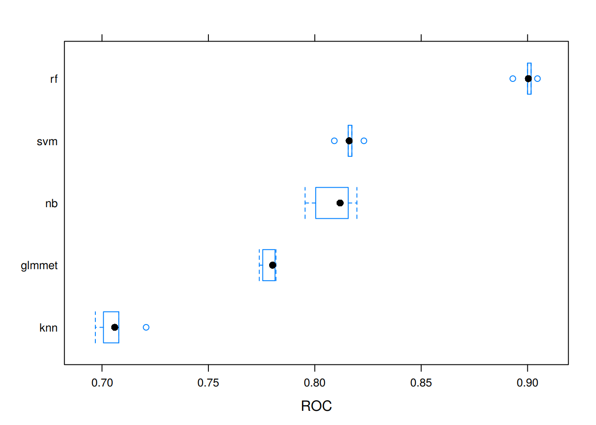
<p class="caption">(\#fig:plotresam)Comparing distributions of AUC values for various models.</p>
</div>

### Pre-processing

The random forest appears to be the best one. This might be related to
its ability to cope well with different types of input and require
little pre-processing.

> Challenge
>
> If you haven't done so, consider pre-processing the data prior to
> training for a model that didn't perform well and assess whether
> pre-processing affected the modelling.

<details>

```r
svm_model1 <- train(churn ~ .,
                    churnTrain,
                    metric = "ROC",
                    method = "svmRadial",
                    tuneLength = 10,
                    trControl = myControl)

svm_model2 <- train(churn ~ .,
                    churnTrain[, c(2, 6:20)],
                    metric = "ROC",
                    method = "svmRadial",
                    preProcess = c("scale", "center", "pca"),
                    tuneLength = 10,
                    trControl = myControl)

model_list <- list(svm1 = svm_model1,
                   svm2 = svm_model2)
resamp <- resamples(model_list)
summary(resamp)
```

```
## 
## Call:
## summary.resamples(object = resamp)
## 
## Models: svm1, svm2 
## Number of resamples: 5 
## 
## ROC 
##           Min.   1st Qu.    Median      Mean   3rd Qu.      Max. NA's
## svm1 0.8091526 0.8153293 0.8161635 0.8161290 0.8171700 0.8228297    0
## svm2 0.8182375 0.8225025 0.8307211 0.8277856 0.8313062 0.8361610    0
## 
## Sens 
##           Min.   1st Qu.    Median      Mean   3rd Qu.      Max. NA's
## svm1 0.1113990 0.1787565 0.2098446 0.2023256 0.2222222 0.2894057    0
## svm2 0.3229974 0.3652850 0.4015544 0.4073516 0.4585492 0.4883721    0
## 
## Spec 
##           Min.   1st Qu.    Median      Mean   3rd Qu.      Max. NA's
## svm1 0.9662281 0.9837719 0.9885965 0.9848246 0.9899123 0.9956140    0
## svm2 0.9684211 0.9701754 0.9758772 0.9766667 0.9828947 0.9859649    0
```

```r
bwplot(resamp, metric = "ROC")
```


</details>

### Predict using the best model

> Challenge
>
> Choose the best model using the `resamples` function and comparing
> the results and apply it to predict the `churnTest` labels.

<details>

```r
p <- predict(rf_model, churnTest)
confusionMatrix(p, churnTest$churn)
```

```
## Confusion Matrix and Statistics
## 
##           Reference
## Prediction  yes   no
##        yes  166    3
##        no    58 1440
##                                           
##                Accuracy : 0.9634          
##                  95% CI : (0.9532, 0.9719)
##     No Information Rate : 0.8656          
##     P-Value [Acc > NIR] : < 2.2e-16       
##                                           
##                   Kappa : 0.8245          
##                                           
##  Mcnemar's Test P-Value : 4.712e-12       
##                                           
##             Sensitivity : 0.74107         
##             Specificity : 0.99792         
##          Pos Pred Value : 0.98225         
##          Neg Pred Value : 0.96128         
##              Prevalence : 0.13437         
##          Detection Rate : 0.09958         
##    Detection Prevalence : 0.10138         
##       Balanced Accuracy : 0.86950         
##                                           
##        'Positive' Class : yes             
## 
```
</details>
