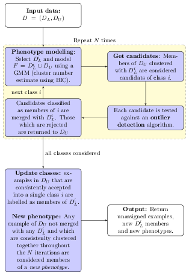

# Final notes 


```r
library(BiocStyle)
```

## Other learning algorithms

### Semi-supervised learning {-}

The idea behind semi-supervised learning is to use labelled
observations to guide the determination of relevant structure in the
unlabelled data. The figures below described the *phenoDisco*
algorithm described
in
[Breckels *et al.* (2013)](https://www.ncbi.nlm.nih.gov/pubmed/23523639).



### Deep learning in R {-}

This book focuses on introductory material in R. This shouldn't
however give the impression that more modern approaches are not
available. R has plenty of activity arounds deep learning such as, for
example, the *[keras](https://CRAN.R-project.org/package=keras)* package, an interface
to [Keras](https://keras.io), a high-level neural networks API.

See [this blog](https://blog.rstudio.com/2017/09/05/keras-for-r/) for
an introduction.

## Model performance

When investigating multi-class problems, it is good to consider
additional performance metrics and to inspect the confusion matrices
in more details, to look if some classes suffer from greater
mis-classification rates.

Models accuracy can also evaluated using the F1 score, where $F1 = 2 ~
\frac{precision \times recall}{precision + recall}$, calculated as the
harmonic mean of the precision ($precision = \frac{tp}{tp+fp}$, a
measure of *exactness* -- returned output is a relevant result) and
recall ($recall=\frac{tp}{tp+fn}$, a measure of *completeness* --
indicating how much was missed from the output). What we are aiming
for are high generalisation accuracy, i.e high $F1$, indicating that
the marker proteins in the test data set are consistently and
correctly assigned by the algorithms.

For a multi-class problem, the macro F1 (mean of class F1s) can be
used.

## Credit and acknowledgements

Many parts of this course have been influenced by the
DataCamp's
[*Machine Learning with R* skill track](https://www.datacamp.com/tracks/machine-learning),
in particular the *Machine Learning Toolbox* (supervised learning
chapter) and the *Unsupervised Learning in R* (unsupervised learning
chapter) courses.

[Jamie Lendrum](https://github.com/jl5000) has addressed numerous
typos in the first version.

The very hands-on approach has also been influenced by the Software
and Data Carpentry lessons and teaching styles.

## References and further reading

- caret: Classification and Regression Training. Max Kuhn.
  [https://CRAN.R-project.org/package=caret](https://CRAN.R-project.org/package=caret).
- [Applied predictive modeling](https://www.springer.com/us/book/9781461468486),
  Max Kuhn and Kjell Johnson (book webpage
  [http://appliedpredictivemodeling.com/](http://appliedpredictivemodeling.com/))
  and the [caret book](https://topepo.github.io/caret/index.html).
- [An Introduction to Statistical Learning (with Applications in
  R)](http://www-bcf.usc.edu/~gareth/ISL/). Gareth James, Daniela
  Witten, Trevor Hastie and Robert Tibshirani.
- [mlr: Machine Learning in R](http://jmlr.org/papers/v17/15-066.html). Bischl
  B, Lang M, Kotthoff L, Schiffner J, Richter J, Studerus E,
  Casalicchio G and Jones Z (2016). Journal of Machine Learning
  Research, *17*(170),
  pp. 1-5. [https://github.com/mlr-org/mlr](https://github.com/mlr-org/mlr).
- DataCamp's
  [*Machine Learning with R* skill track](https://www.datacamp.com/tracks/machine-learning) (requires
  paid access).

## Session information


```r
sessionInfo()
```

```
## R version 3.6.0 (2019-04-26)
## Platform: x86_64-pc-linux-gnu (64-bit)
## Running under: Ubuntu 18.04.2 LTS
## 
## Matrix products: default
## BLAS:   /opt/R/3.6.0/lib/R/lib/libRblas.so
## LAPACK: /opt/R/3.6.0/lib/R/lib/libRlapack.so
## 
## locale:
##  [1] LC_CTYPE=en_US.UTF-8       LC_NUMERIC=C              
##  [3] LC_TIME=en_US.UTF-8        LC_COLLATE=en_US.UTF-8    
##  [5] LC_MONETARY=en_US.UTF-8    LC_MESSAGES=en_US.UTF-8   
##  [7] LC_PAPER=en_US.UTF-8       LC_NAME=C                 
##  [9] LC_ADDRESS=C               LC_TELEPHONE=C            
## [11] LC_MEASUREMENT=en_US.UTF-8 LC_IDENTIFICATION=C       
## 
## attached base packages:
## [1] stats     graphics  grDevices utils     datasets  methods   base     
## 
## other attached packages:
## [1] BiocStyle_2.12.0 logging_0.9-107 
## 
## loaded via a namespace (and not attached):
##  [1] Rcpp_1.0.1         bookdown_0.11      digest_0.6.19     
##  [4] crayon_1.3.4       rprojroot_1.3-2    backports_1.1.4   
##  [7] magrittr_1.5       evaluate_0.14      stringi_1.4.3     
## [10] rstudioapi_0.10    rmarkdown_1.13     tools_3.6.0       
## [13] stringr_1.4.0      xfun_0.7           yaml_2.2.0        
## [16] compiler_3.6.0     BiocManager_1.30.4 htmltools_0.3.6   
## [19] knitr_1.23
```
